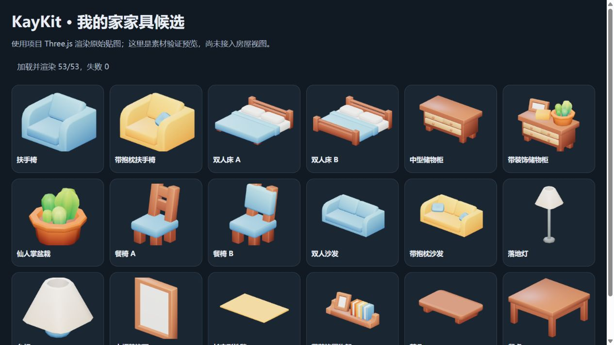
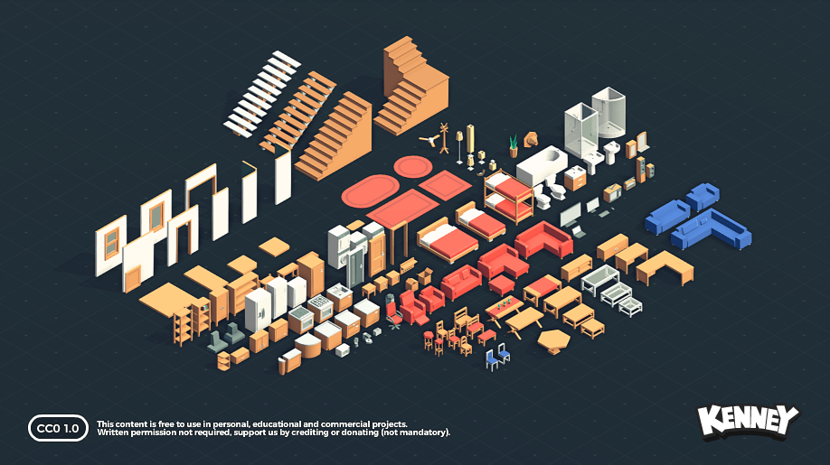

# 我的家：可复用家具素材库

更新：2026-10-01。用户已选择 **KayKit Furniture Bits 为主要家具风格**。已保存免费版 53 个模型、整理为 53 个自包含 GLB，并生成 53 张单品预览；优先候选 18 个。原有 140 个 Kenney 模型保留为储备。素材尚未接入运行中的 Three.js 场景。

## 当前主选：KayKit

- [`kaykit-furniture-bits/glb/`](kaykit-furniture-bits/glb/)：53 个可独立加载的 GLB，保留原始几何、UV 和贴图。
- [`kaykit-furniture-bits/gltf/`](kaykit-furniture-bits/gltf/)：原始 glTF 与几何二进制，图片引用统一指向 [`texture/`](kaykit-furniture-bits/texture/) 下的 1024×1024 共用图集，便于后续在运行时复用贴图。
- [`kaykit-furniture-bits/previews/`](kaykit-furniture-bits/previews/)：本项目用 Three.js 和原始模型/贴图渲染的 53 张单品预览。
- [`SOURCE.json`](kaykit-furniture-bits/SOURCE.json)、[`LICENSE.txt`](kaykit-furniture-bits/LICENSE.txt)：作者来源、固定下载版本、SHA-256 和 CC0 原始许可。
- [`verification.json`](kaykit-furniture-bits/verification.json)：浏览器实际加载/渲染 53/53，失败 0，记录几何统计和原始包围盒。

来源：[KayKit 作者页面](https://kaylousberg.itch.io/furniture-bits)与[作者发布的免费仓库](https://github.com/KayKit-Game-Assets/KayKit-Furniture-Bits-1.0)。本轮使用免费版，没有购买 EXTRA 或 SOURCE。



优先使用沙发、扶手椅、床、收纳柜、桌椅、台灯/落地灯、地毯、盆栽和装饰画。保持原始柔和配色，实际场景审阅后再微调。厨房专用模型、壁挂空调、智能插座和温度传感器需要补齐。

## 查看与使用

- 双击 [`catalog.html`](catalog.html)，可离线浏览预览、名称并保存对应 GLB，不需要安装软件。
- [`catalog.json`](catalog.json) 记录分类、候选、文件路径、SHA-256、材质名称、网格数量、三角形数量与原始包围盒。
- [`kenney-furniture-kit/Preview.png`](kenney-furniture-kit/Preview.png) 是储备库作者提供的整包预览。
- 两套素材均可用 Blender 导入，后续用 Three.js `GLTFLoader` 加载。



## 储备：Kenney 来源和保存范围

来源为 [Kenney Furniture Kit](https://kenney.nl/assets/furniture-kit)，下载包内标记版本 2.0。授权为 **CC0-1.0**；原始许可保留在 [`License.txt`](kenney-furniture-kit/License.txt)，来源、下载地址与原包校验值见 [`SOURCE.json`](kenney-furniture-kit/SOURCE.json)。

只保留项目可用的 GLB、每个模型一张预览及原始许可，总大小约 2.5 MB；重复的 OBJ/FBX/STL 等未加入素材库。完整原包保存在本机 `E:\smart-home\runtime\perception\asset-downloads\kenney-furniture-kit.zip`，该缓存不纳入 Git。

两套素材库都放在 `web/` 外，当前构建与 Android APK 不会自动打包。接入时仅把选中的模型放入前端资源目录，避免无用素材拖慢平板。KayKit 完整下载包缓存在 `E:\smart-home\runtime\perception\asset-downloads\kaykit-furniture-bits-1.0.zip`。

## Kenney 储备候选

| 空间 / 类型 | 候选 |
| --- | --- |
| 客厅 | 简洁双人沙发、转角沙发、长沙发、休闲椅、木质/玻璃茶几、电视柜、电视、圆角地毯、盆栽 |
| 卧室 / 书房 | 双人/单人床、床头柜、带门收纳柜、书桌、书桌椅 |
| 厨房 | 地柜、吊柜、冰箱、水槽、电灶、抽油烟机 |
| 灯具 | 顶灯、壁灯、落地灯、台灯、吊扇 |
| 其他 | 洗衣机、洗手盆、淋浴间 |

Kenney 后续用于补齐主选库缺少的物品；混用时先核对比例和风格，避免同一空间出现明显不同的家具语言。原始文件和颜色保留。

## 接入约定

1. 文件名是素材 ID；家庭服务的稳定设备 ID 是设备实例绑定键，两者分别保存。同款灯具可以对应不同房间的不同设备。
2. 每个 GLB 在接入时按包围盒校准大小、旋转与落点；目录的原始尺寸不代表已测量的真实米制尺寸。
3. 克隆实例材质后调整颜色/自发光，避免同款家具互相影响。KayKit 多数模型用同一图集材质，修改材质自发光会让整件家具发亮；灯具应另设局部发光面或遮罩，不可直接让整盏灯发光。
4. 模型只提供外形。开关、亮度、空调气流等效果由新鲜且已确认的设备状态驱动，不能把导入模型当成已实现状态反馈。
5. 此包没有壁挂空调、智能插座和温度传感器专用模型，后续以米白外壳、圆角和低面数补齐。

## 本轮验证与后续

- 原包 ZIP CRC 校验通过，下载 SHA-256 已记录。
- 140 个 GLB 的文件头、版本、嵌入资源检查通过，无外部纹理依赖。
- 使用项目已有 Three.js `GLTFLoader` 实际解析 **140/140**，均有有效网格和包围盒；最大单个 GLB 72,048 字节。
- KayKit 53 个 GLB 已在浏览器中实际加载、解码贴图并渲染成功，生成对应预览；原 glTF 的资源引用也已核对。
- 尚未完成在实际房屋尺度、灯光与平板上的验收；素材预览成功不代表设备状态效果已经实现。
- 灯光亮度、空调气流、插座和温度传感器效果的实施及验收，见[Three.js 素材与设备效果计划](../../../docs/superpowers/plans/2026-10-01-threejs-assets-and-device-effects.md)。

### 重现 KayKit 浏览器验证

在 `E:\smart-home` 运行：

```powershell
.\.venv\Scripts\python.exe -m http.server 8786 --bind 127.0.0.1 --directory apps/perception-console
```

打开 `http://127.0.0.1:8786/scene-assets/kaykit-furniture-bits/verify-preview.html`，页面显示加载/渲染计数。使用项目已有 `web/node_modules/three`，不是运行中的终端服务。验证后按 Ctrl+C 关闭。日常看图只需双击 `catalog.html`，不需这个预览服务器。
